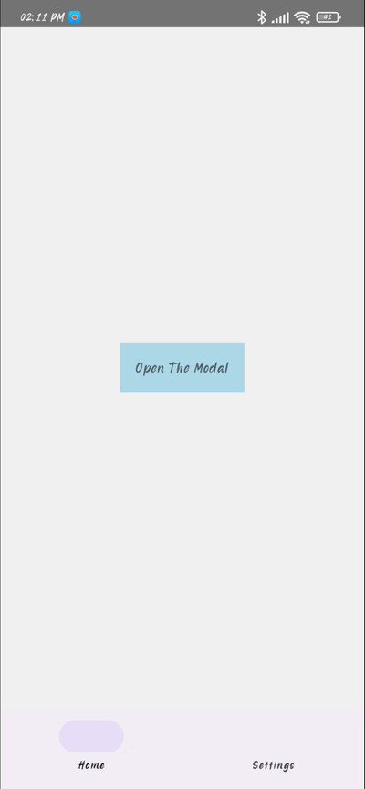
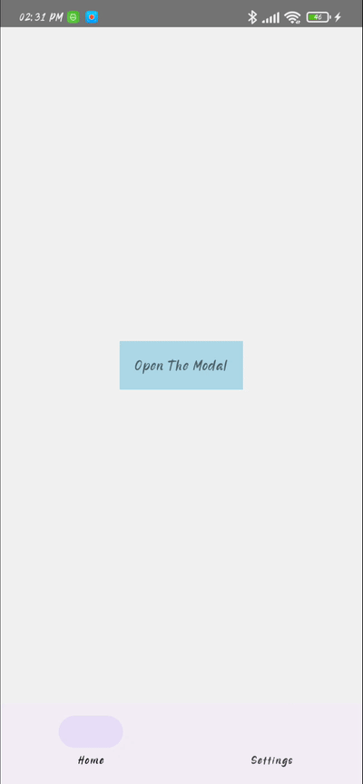

# Getting Started

>**Note**: Make sure you have completed the [React Native - Environment Setup](https://reactnative.dev/docs/environment-setup) instructions till "Creating a new application" step, before proceeding.


## This is a Custom Modal with Bottom Bar
**Note**: Maybe you could't find a way to create a custom modal with a bottom bar. Here's an example.



## Step 1: Start the Metro Server

First, you will need to start **Metro**, the JavaScript _bundler_ that ships _with_ React Native.

To start Metro, run the following command from the _root_ of your React Native project:

```bash
# using npm
npm start

# OR using Yarn
yarn start
```
## Specific configuration

```javascript
// Show modal
{showModal && <Modal showModal={showModal} callBackFunction={callBackFunction} />}

```

### ./src/homeScreen.js
- When you write the modal in a screen component &#10060;
```javascript
import {
  View,
  TouchableOpacity,
  Text,
} from 'react-native';
import React from 'react';
import Modal from './modal';

export default function HomeScreen() {
  const [showModal, setShowModal] = React.useState(false);
  const callBackFunction = React.useCallback(() => {
    setShowModal(prev => !prev);
  }, [showModal]);
  return (
    <View
      style={{
        width: '100%',
        height: '100%',
        justifyContent: 'center',
        alignItems: 'center',
      }}>
      <TouchableOpacity
        onPress={callBackFunction}
        style={{backgroundColor: 'lightblue', padding: 15}}>
        <Text>Open The Modal</Text>
      </TouchableOpacity>
      {showModal && <Modal showModal={showModal} callBackFunction={callBackFunction} />}
    </View>
  );
}

```


## Contacts
- LinkedIn: https://www.linkedin.com/in/yasin-unluoglu-ba47831a3/
- E-Mail: ysn.unlgl@gmail.com